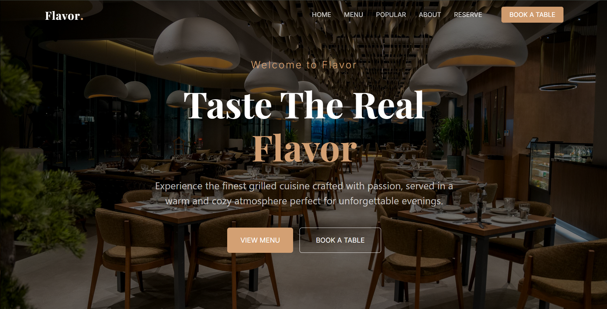
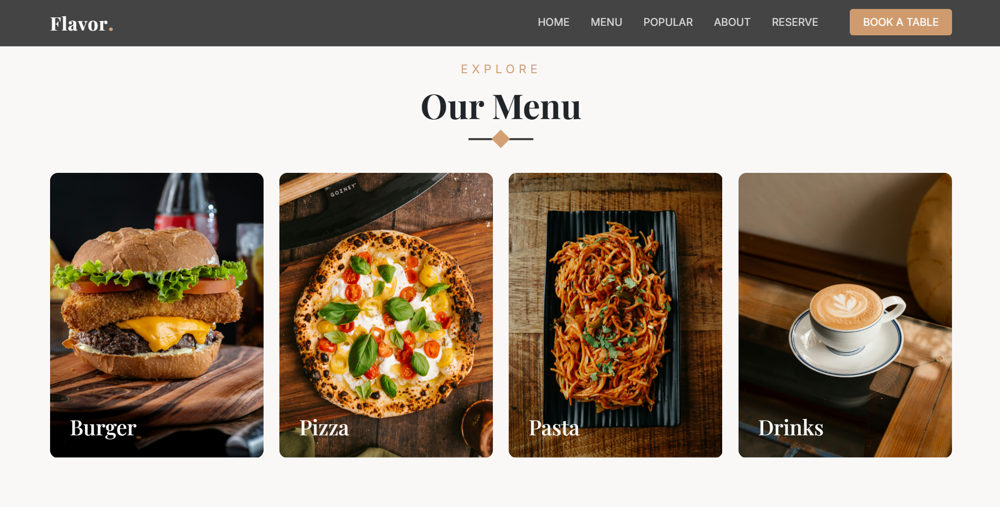
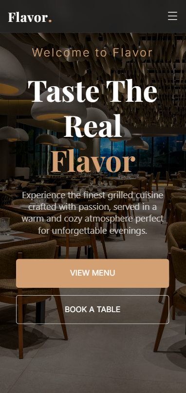

# 🍽️ Flavor Restaurant Website

A modern and fully responsive restaurant website built using HTML, CSS, JavaScript, and Bootstrap.

## 🚀 Live Demo
🔗 https://ibrahimherisha.github.io/flavor-restaurant-website/

---

## 🛠️ Built With
- HTML5  
- CSS3  
- JavaScript  
- Bootstrap  

---

## ✨ Features
- Fully Responsive Design  
- Smooth Scroll Animations  
- Interactive Navigation Bar  
- Modern UI Layout  
- Clean Folder Structure  

---

## 👨‍💻 Author
Developed by **Ibrahim Herisha**  
Frontend Developer

---

## 📸 Preview

### 🖥 Desktop View

### 🍔 Menu Section

### 📱 Mobile View

